# ItemPicking機能 設計書

## 1. システム概要

本システムは、Infor CloudSuite Industrial (CSI)上で動作するピッキング作業支援機能です。QRコードスキャンによる在庫品目の照合と、ピッキング数の入力・管理を行います。

---

## 2. システム関連図

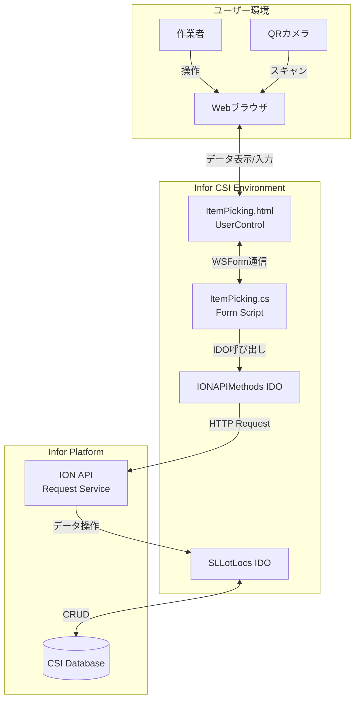

---

## 3. アーキテクチャ図

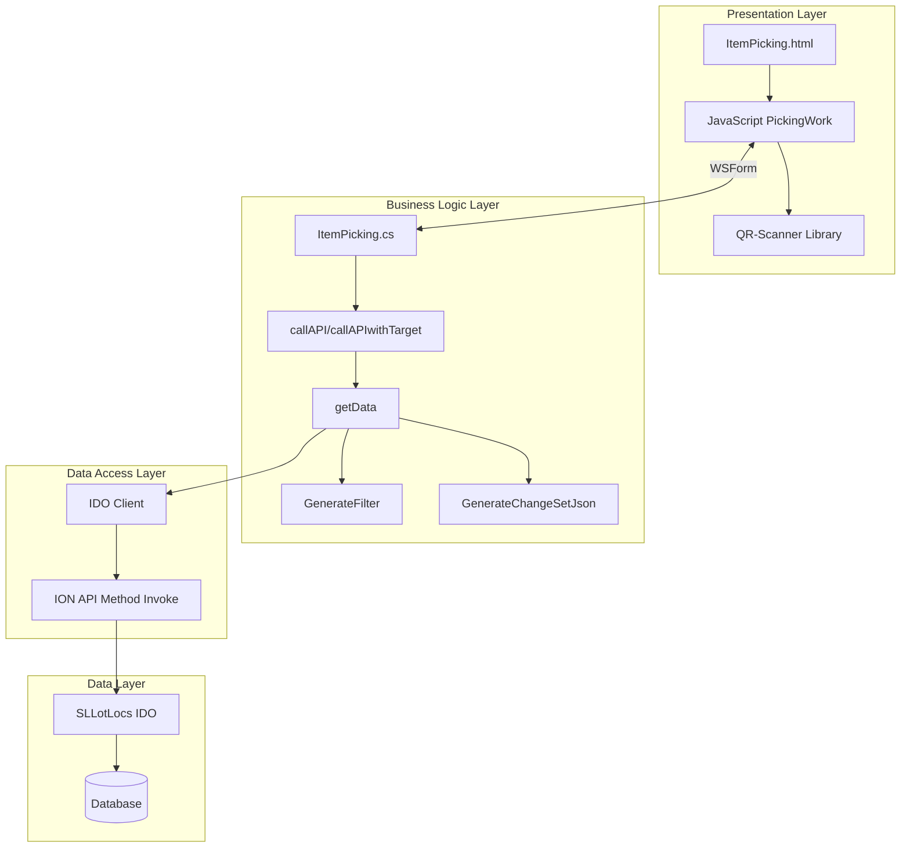

---

## 4. シーケンス図（機能フロー）

### 4.1 データ取得フロー

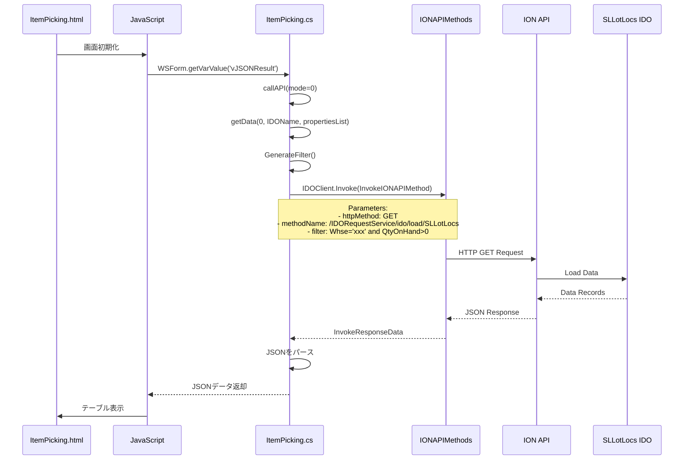

### 4.2 データ更新フロー

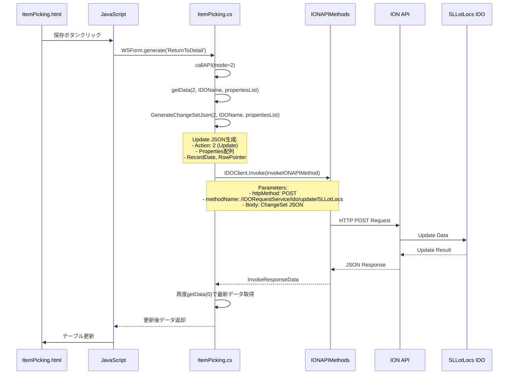

---

## 5. シーケンス図（ユーザー操作）

### 5.1 QRコードスキャン操作

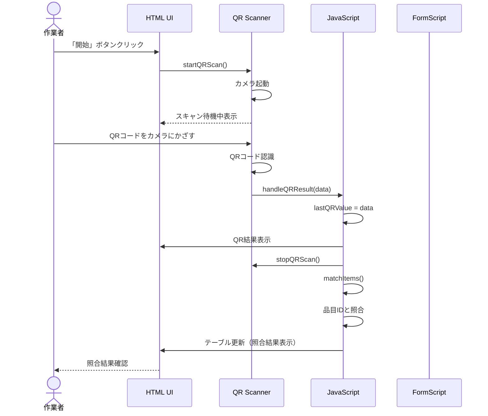

### 5.2 ピッキング作業フロー

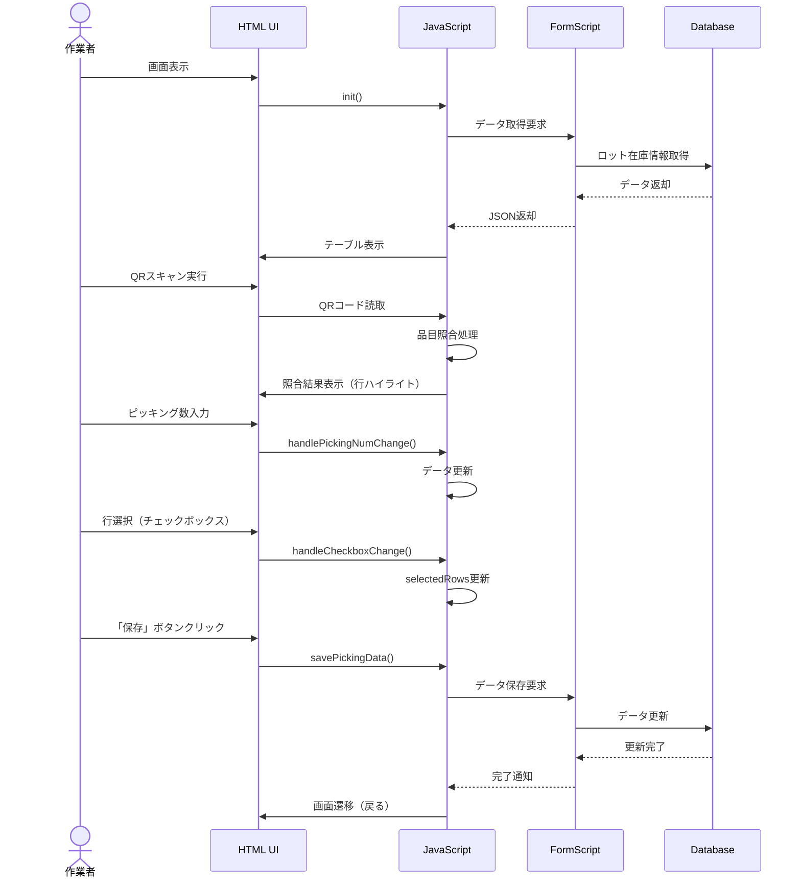

---

## 6. クラス図

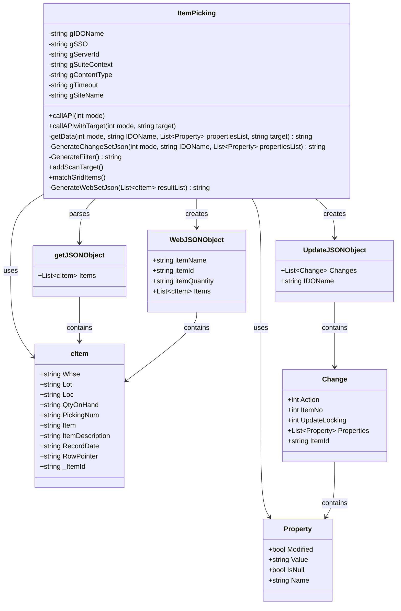

---

## 7. コンポーネント関連図

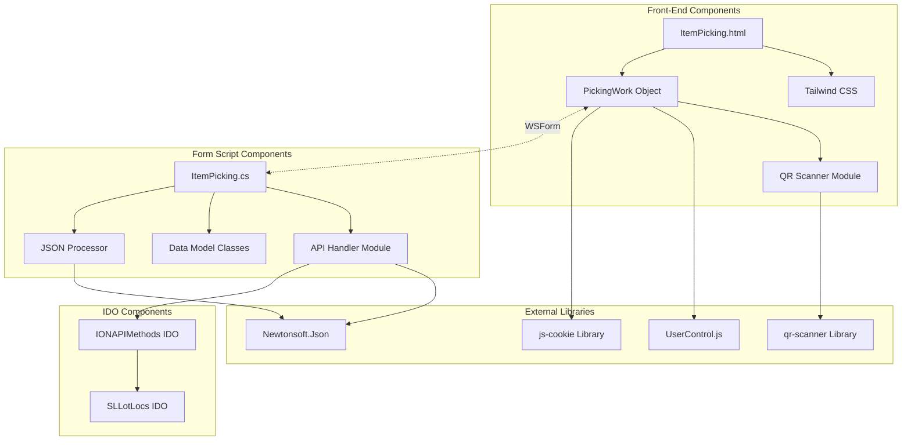

---

## 8. データフロー図

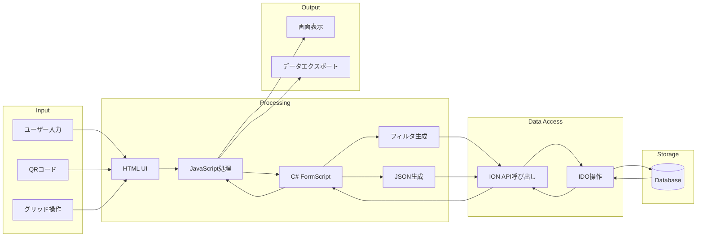

---

## 9. 配置図

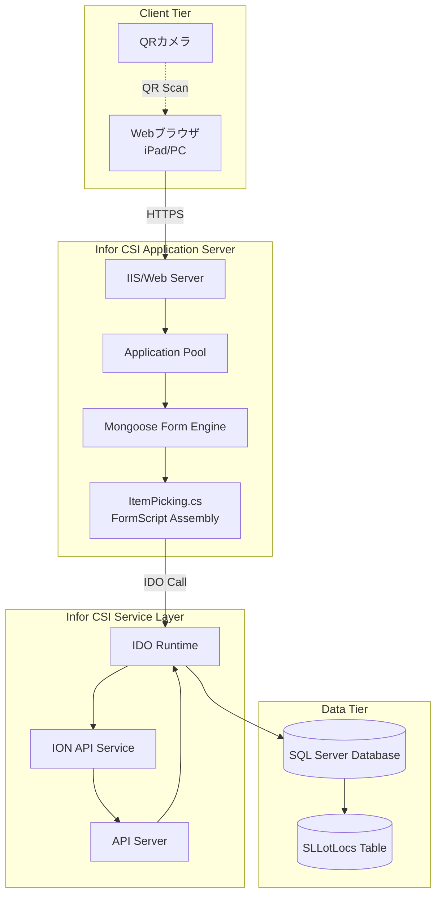

---

## 10. IDOと項目リスト

### 10.1 使用IDO

| IDO名 | 用途 | アクセス方法 |
|-------|------|-------------|
| SLLotLocs | ロット在庫場所情報 | ION API経由 |
| IONAPIMethods | ION APIメソッド呼び出し | 直接IDO呼び出し |

### 10.2 SLLotLocs IDO プロパティ

| プロパティ名 | データ型 | 説明 | 必須 | 備考 |
|-------------|---------|------|------|------|
| Whse | string | 倉庫コード | ○ | 検索条件 |
| Lot | string | ロット番号 | ○ | 検索キー/表示 |
| Loc | string | 場所コード | ○ | 表示 |
| QtyOnHand | string/decimal | 手持数量 | ○ | 表示/フィルタ条件 |
| PickingNum | string/int | ピッキング番号 | × | 表示 |
| Item | string | 品目コード | ○ | 照合キー |
| ItemDescription | string | 品目説明 | × | 表示 |
| RecordDate | string/datetime | レコード日付 | ○ | 更新キー |
| RowPointer | string/guid | 行ポインタ | ○ | 更新キー |
| _ItemId | string | アイテムID | ○ | 更新キー |

### 10.3 IONAPIMethods IDO メソッド

| メソッド名 | パラメータ | 説明 |
|-----------|----------|------|
| InvokeIONAPIMethod | sso, serverId, suiteContext, httpMethod, methodName, parameters, contentType, timeout | ION APIエンドポイントを呼び出し |

---

## 11. 画面項目リスト

### 11.1 ヘッダー情報

| 項目名 | HTML ID | データ型 | 表示/入力 | 説明 |
|-------|---------|---------|----------|------|
| 品目名 | itemName | string | 表示 | 作業対象品目の名称 |
| 品目ID | itemId | string | 表示 | 作業対象品目のID |
| 品目数 | itemQuantity | number | 表示 | 作業対象の数量 |

### 11.2 QRコードセクション

| 項目名 | HTML ID | データ型 | 表示/入力 | 説明 |
|-------|---------|---------|----------|------|
| QRステータスメッセージ | qrStatusMessage | string | 表示 | スキャン状態メッセージ |
| ビデオコンテナ | videoContainer | - | 表示 | カメラ映像表示エリア |
| QR結果 | qrResult | string | 表示 | スキャン結果テキスト |
| 開始ボタン | - | button | 入力 | QRスキャン開始 |
| 停止ボタン | - | button | 入力 | QRスキャン停止 |
| 手入力ボタン | - | button | 入力 | QRコード手入力 |

### 11.3 詳細テーブル

| カラム名 | データ型 | 表示/入力 | 説明 | 対応プロパティ |
|---------|---------|----------|------|--------------|
| 選択 | checkbox | 入力 | 行選択チェックボックス | - |
| ロット | string | 表示 | ロット番号 | Lot |
| 倉庫 | string | 表示 | 倉庫コード | Whse |
| 場所 | string | 表示 | 場所コード | Loc |
| 品目数 | number | 表示 | 手持数量 | QtyOnHand |
| ピック状況 | number | 表示 | ピッキング状態（0/1） | sPickingStatus |
| ピック数 | number | 入力 | ピッキング数量入力 | PickingNum |
| 品目ID | string | 表示 | 品目コード | Item |
| 照合結果 | string | 表示 | QR照合結果（一致/不一致） | sMatching |

### 11.4 操作ボタン

| ボタン名 | HTML ID | 説明 | 実行処理 |
|---------|---------|------|---------|
| 戻る | - | 前画面に戻る | goBack() → WSForm.generate('ReturnToDetail') |
| 保存 | saveButton | データを保存 | savePickingData() → WSForm.generate('ReturnToDetail') |

---

## 12. 業務固有処理仕様（152行目以前）

### 12.1 グローバル変数設定

```csharp
string gIDOName = "SLLotLocs";                  // ターゲットIDO名
string gSSO = "1";                              // SSO使用フラグ
string gServerId = "0";                         // APIサーバID
string gSuiteContext = "CSI";                   // APIスイートコンテキスト
string gContentType = "application/json";       // レスポンスタイプ
string gTimeout = "10000";                      // タイムアウト（ミリ秒）
string gSiteName = "Q72Q74BY8XUT3SKY_TRN_AJP";  // サイト名
```

**仕様書生成用パラメータ：**
- IDO名を指定
- サイト名を環境に応じて設定
- その他はデフォルト値推奨

### 12.2 データモデルクラス（cItem）

**目的：** IDOプロパティとJSONシリアライゼーションのマッピング

**プロパティ定義：**

| プロパティ名 | JSON名 | データ型 | 用途 |
|------------|--------|---------|------|
| Whse | Whse | string | 倉庫コード（取得/更新） |
| Lot | Lot | string | ロット番号（取得/更新） |
| Loc | Loc | string | 場所コード（取得/更新） |
| QtyOnHand | QtyOnHand | string | 手持数量（取得/更新） |
| PickingNum | PickingNum | string | ピッキング番号（取得/更新） |
| Item | Item | string | 品目コード（取得/更新） |
| ItemDescription | ItemDescription | string | 品目説明（取得/更新） |
| RecordDate | RecordDate | string | レコード日付（更新キー） |
| RowPointer | RowPointer | string | 行ポインタ（更新キー） |
| _ItemId | _ItemId | string | アイテムID（更新キー） |

**仕様書生成時の注意：**
- IDOのプロパティ名と一致させる
- 更新処理に必要なキー項目（RecordDate, RowPointer, _ItemId）は必須
- JsonPropertyアトリビュートでJSON名を明示

### 12.3 callAPI / callAPIwithTarget メソッド

**目的：** IDO操作の統一インターフェース

**パラメータ：**

| パラメータ名 | 型 | 説明 |
|------------|-----|------|
| mode | int | 操作モード（0:取得, 1:挿入, 2:更新, 4:削除） |
| target | string | 特定検索用の値（例：ロット番号） |

**処理フロー：**

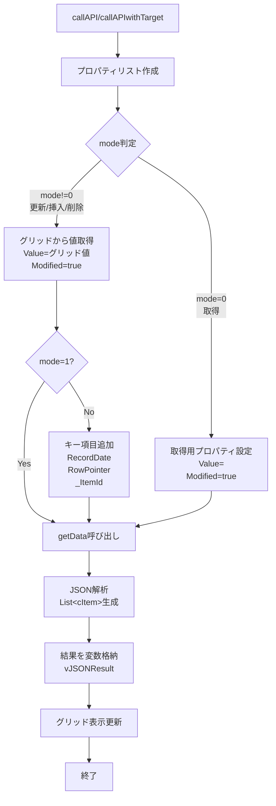

**仕様書生成用の設定項目：**

1. **取得モード（mode=0）のプロパティ：**
   - 取得したいすべてのプロパティ名を列挙
   - Value=""、Modified=true で設定

2. **更新/削除モード（mode!=0）のプロパティ：**
   - グリッドカラム位置と対応するプロパティのマッピング
   - キー項目の取得元カラム位置を指定

3. **グリッド構造：**
   - 各カラムのインデックスとプロパティ名の対応表

**サンプルマッピング：**

| グリッドカラム | インデックス | プロパティ名 |
|--------------|-----------|------------|
| 倉庫 | 1 | Whse |
| ロット | 2 | Lot |
| 場所 | 3 | Loc |
| 数量 | 4 | QtyOnHand |
| 品目 | 5 | Item |
| ... | ... | ... |
| RecordDate | 9 | RecordDate |
| RowPointer | 10 | RowPointer |
| _ItemId | 11 | _ItemId |

### 12.4 GenerateFilter メソッド

**目的：** IDO検索フィルタの動的生成

**フィルタ条件：**

| 変数名 | 対応プロパティ | 条件 |
|-------|-------------|------|
| gWhse | Whse | Whse='xxx' |
| - | QtyOnHand | QtyOnHand>0（固定） |

**生成ロジック：**

```csharp
string header = "&filter=";
string filter = "";

// 倉庫コードフィルタ
if(ThisForm.Variables("gWhse").Value != ""){
    if(filter != ""){filter += " and ";}
    filter += $"Whse='{ThisForm.Variables("gWhse").Value}'";
}

// 数量フィルタ（固定）
if(filter != ""){filter += " and ";}
filter += $"QtyOnHand>0";

return filter == "" ? "" : header + filter;
```

**仕様書生成時の定義：**
- フォーム変数名と対応するIDOプロパティ
- 固定条件の定義
- AND/OR条件の組み合わせルール

### 12.5 addScanTarget メソッド

**目的：** QRスキャン結果に基づく特定データ追加

**処理：**
```csharp
public void addScanTarget(){
    callAPIwithTarget(0, ThisForm.Variables("HiddenValue").Value);
}
```

**仕様：**
- HiddenValue変数からスキャン値を取得
- 該当するロット番号でフィルタして取得
- 既存グリッドに行追加

### 12.6 matchGridItems メソッド

**目的：** 品目ID照合処理

**処理：**
```csharp
public void matchGridItems(){
    int count = ThisForm.Components["ResultGrid"].GetGridRowCount();
    if(count == 0) return;
    if(ThisForm.Variables("HiddenValue").Value == "")
        ThisForm.Variables("HiddenValue").Value = ThisForm.Variables("gItem").Value;
        
    for(int i = 1; i < count+1; i++){
        if(ThisForm.Components["ResultGrid"].GetGridValue(i,6) == ThisForm.Variables("HiddenValue").Value){
            ThisForm.Components["ResultGrid"].SetGridValue(i,8,"OK");
        }
        else{
            ThisForm.Components["ResultGrid"].SetGridValue(i,8,"NG");
        }
    }
}
```

**仕様：**
- 品目IDカラム（インデックス6）と比較値を照合
- 照合結果カラム（インデックス8）に"OK"/"NG"を設定
- HiddenValue変数または gItem変数から比較値を取得

### 12.7 GenerateWebSetJson メソッド

**目的：** Web表示用JSON整形

**出力構造：**
```json
{
  "itemName": "品目名",
  "itemId": "品目ID",
  "itemQuantity": "数量",
  "Items": [
    { /* cItemオブジェクト配列 */ }
  ]
}
```

**取得元：**
- itemName: gDescription変数
- itemId: gItem変数
- itemQuantity: gQtyOrderedConv変数
- Items: APIから取得したcItemリスト

---

## 13. 共通処理仕様（152行目以降）

### 13.1 getData メソッド

**シグネチャ：**
```csharp
private string getData(int mode, string IDOName, List<Property> propertiesList, string target)
```

**パラメータ：**
- mode: 0=GET, 1=INSERT, 2=UPDATE, 4=DELETE
- IDOName: 対象IDO名
- propertiesList: プロパティリスト
- target: 特定検索値

**処理概要：**
1. HTTPメソッドとエンドポイント決定
2. パラメータJSON生成
3. IONAPIMethodsのInvokeIONAPIMethod呼び出し
4. レスポンス処理
5. 更新系処理後は再取得

### 13.2 GenerateChangeSetJson メソッド

**目的：** IDO更新用JSONの生成

**出力構造：**
```json
{
  "IDOName": "SLLotLocs",
  "Changes": [
    {
      "Action": 2,
      "ItemNo": 0,
      "UpdateLocking": 0,
      "ItemId": "new1",
      "Properties": [
        {
          "Name": "Whse",
          "Value": "xxx",
          "Modified": true,
          "IsNull": false
        }
      ]
    }
  ]
}
```

---

## 14. エラーハンドリング

### 14.1 FormScript側

```csharp
if (response.IsReturnValueStdError())
{
    string errorMsg = response.Parameters[8].Value;
    errorMsg += "\r\n" + response.Parameters[11].Value;
    throw new Exception(string.Format("Trigger of IONAPI Method Failed : {0}", errorMsg));
}
```

### 14.2 JavaScript側

```javascript
.catch(function(error) {
    PickingWork.showQRStatus('カメラアクセスエラー: ' + error.message, 'error');
})
```

---

## 15. 環境依存設定項目

| 項目 | 値 | 変更方法 |
|------|-----|---------|
| gSiteName | Q72Q74BY8XUT3SKY_TRN_AJP | 環境に応じて変更 |
| gIDOName | SLLotLocs | 業務に応じて変更 |
| gServerId | 0 | API Server設定に応じて変更 |
| QRライブラリURL | https://unpkg.com/qr-scanner@1.4.2/qr-scanner.umd.min.js | 必要に応じて変更 |

---

## 16. セキュリティ考慮事項

1. **SSO認証：** gSSO="1"で有効化
2. **X-Infor-MongooseConfig ヘッダー：** サイト名による認証
3. **HTTPSのみ対応**
4. **QRカメラアクセス：** ユーザー許可必須

---

## 17. パフォーマンス最適化

1. **データ取得：**
   - フィルタ条件で必要最小限のデータ取得
   - QtyOnHand>0 で在庫あり品目のみ

2. **UI更新：**
   - テーブル全体再描画（行数制限推奨）
   - 照合処理はクライアント側で実施

3. **QRスキャン：**
   - スキャン成功後は自動停止
   - カメラリソース解放

---

この設計書を基に、新規業務のピッキング機能を実装する際は、以下の手順で対応してください：

1. **グローバル変数**を業務に合わせて設定
2. **cItemクラス**を対象IDOに合わせて定義
3. **callAPI**メソッド内のグリッドマッピングを調整
4. **GenerateFilter**メソッドでフィルタ条件を実装
5. 業務固有メソッド（addScanTarget, matchGridItems等）を実装
6. HTML側の表示項目とイベントハンドラを調整

共通処理（getData以降）は変更不要です。