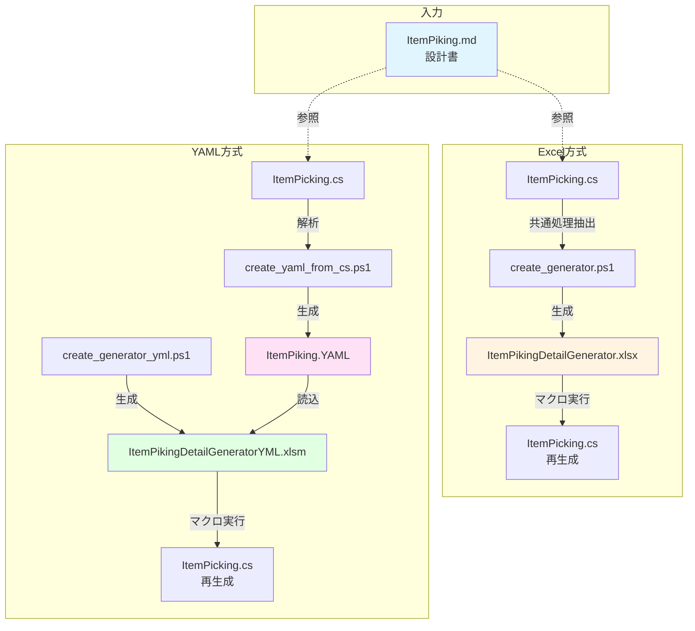

# ItemPicking コード生成システム - 全体概要

## システムアーキテクチャ



## ファイル一覧

### 設計・ドキュメント
| ファイル | サイズ | 説明 |
|---------|-------|------|
| ItemPiking.md | 25 KB | 設計書（元資料） |
| ItemPikingDetailGenerator使い方.md | 7.2 KB | Excel方式の使い方 |
| ItemPikingDetailGeneratorYML使い方.md | 14 KB | YAML方式の使い方 |

### ソースコード
| ファイル | 行数 | 説明 |
|---------|------|------|
| ItemPicking.cs | 481行 | 生成対象C#ファイル |
| ├─ 1-151行 | - | 業務固有処理 |
| └─ 152-481行 | - | 共通処理 |
| ItemPicking.html | 1009行 | ユーザーインターフェース |

### Excel方式
| ファイル | サイズ | 説明 |
|---------|-------|------|
| ItemPikingDetailGenerator.xlsx | 25.5 KB | コード生成Excelツール |
| create_generator_ItemPicking.ps1 | 30.3 KB | Excelツール生成スクリプト |

### YAML方式
| ファイル | サイズ | 説明 |
|---------|-------|------|
| ItemPiking.YAML | 6.8 KB | コード生成定義ファイル |
| ItemPikingDetailGeneratorYML.xlsm | - | YAML版Excelツール |
| create_generator_yml.ps1 | 25 KB | YAML版Excelツール生成 |
| create_yaml_from_cs.ps1 | 8 KB | C#からYAML生成 |

### プロジェクト設定
| ファイル | 説明 |
|---------|------|
| EditWinStudioScript.csproj | C#プロジェクトファイル |
| EditWinStudioScript.sln | ソリューションファイル |
| mg-bin/*.dll | Mongoose参照DLL（5個） |

## コード構造

### ItemPicking.cs (481行)

```
┌─────────────────────────────────────┐
│ 1-16:   References & Usings         │
├─────────────────────────────────────┤
│ 17-18:  Namespace & Class declaration│
├─────────────────────────────────────┤
│ 19-29:  Global variables (gXXX)     │  ← Excel/YAML: GlobalConfig
├─────────────────────────────────────┤
│ 31-70:  cItem class                  │  ← Excel/YAML: ItemProperties
│         - Data properties (7)        │
│         - Internal properties (3)    │
├─────────────────────────────────────┤
│ 72-76:  callAPI() method             │  ← Excel/YAML: CallAPI
├─────────────────────────────────────┤
│ 78-151: callAPIwithTarget() method   │  ← Excel/YAML: CallAPIWithTarget
│         - PropertyList mode=0        │     - CallAPIPropertiesMode0
│         - PropertyList else          │     - CallAPIPropertiesElse
│         - PropertyList keys          │     - CallAPIPropertiesKey
│         - Grid display               │     - GridDisplay
├═════════════════════════════════════┤ ← 152行目: 共通処理開始
│ 152-262: getData()                   │
│ 264-300: GenerateChangeSetJson()     │
│ 302-334: GenerateFilter()            │  ← Excel/YAML: CommonTail
│ 336-339: addScanTarget()             │
│ 341-354: matchGridItems()            │
│ 356-370: GenerateWebSetJson()        │
│ 372-481: JSON classes (5 classes)    │
└─────────────────────────────────────┘
```

## データフロー

### Excel方式のデータフロー

```
ItemPicking.cs (実装)
    ↓ [共通処理を抽出]
    ↓ create_generator_ItemPicking.ps1
    ↓
ItemPikingDetailGenerator.xlsx
    ├─ SpecData シート (業務固有処理定義)
    │   ├─ Usings テーブル (12行)
    │   ├─ GlobalConfig テーブル (7行)
    │   ├─ ItemProperties テーブル (10行)
    │   ├─ CallAPIPropertiesMode0 テーブル (9行)
    │   ├─ CallAPIPropertiesElse テーブル (6行)
    │   ├─ CallAPIPropertiesKey テーブル (3行)
    │   └─ GridDisplay テーブル (11行)
    └─ CommonTail シート (共通処理)
        └─ TailLines テーブル (330行)
    
    ↓ [マクロ: GenerateItemPicking]
    ↓
ItemPicking.cs (再生成)
```

### YAML方式のデータフロー

```
ItemPicking.cs (実装)
    ↓ [解析・抽出]
    ↓ create_yaml_from_cs.ps1
    ↓
ItemPiking.YAML (定義ファイル)
    ├─ metadata (基本情報)
    ├─ references (DLL参照)
    ├─ usings (using文)
    ├─ globalVariables (グローバル変数)
    ├─ itemClass (cItemクラス)
    ├─ methods (メソッド定義)
    └─ commonProcessing (共通処理参照)
    
    ↓ [PowerShell: ConvertFrom-Yaml]
    ↓
JSON (中間形式)
    
    ↓ [Excel VBA: JsonConverter]
    ↓ ItemPikingDetailGeneratorYML.xlsm
    ↓ [マクロ: GenerateCodeFromYaml]
    ↓
ItemPicking.cs (再生成)
```

## 処理フロー比較

### Excel方式

```
開発者
  ↓ [Excelを開く]
SpecDataシート
  ↓ [テーブル編集]
  ↓ [マクロ実行]
VBAコード生成エンジン
  ↓ [CommonTailから共通処理読込]
  ↓ [C#コード生成]
ItemPicking.cs
```

**所要時間**: 約1-2分  
**難易度**: ★☆☆☆☆

### YAML方式

```
開発者
  ↓ [YAMLファイルを開く]
ItemPiking.YAML
  ↓ [テキスト編集]
  ↓ [Excelマクロ実行]
VBAコード
  ↓ [PowerShell起動]
PowerShell
  ↓ [YAMLをJSONに変換]
JSON
  ↓ [VBAでパース]
VBAコード生成エンジン
  ↓ [元のC#から共通処理読込]
  ↓ [C#コード生成]
ItemPicking.cs
```

**所要時間**: 約2-3分  
**難易度**: ★★☆☆☆

## 機能比較マトリクス

| 機能 | Excel方式 | YAML方式 |
|-----|----------|---------|
| **編集インターフェース** | GUI (Excel) | テキスト |
| **バージョン管理** | ✗ | ✓ |
| **差分確認** | ✗ | ✓ |
| **マージ操作** | ✗ | ✓ |
| **自動化対応** | △ | ✓ |
| **CI/CD統合** | ✗ | ✓ |
| **学習コスト** | 低 | 中 |
| **検証容易性** | △ | ✓ |
| **複数人編集** | ✗ | ✓ |
| **テンプレート共有** | △ | ✓ |
| **依存ソフト** | Excel | PowerShell + Module |
| **実行速度** | 速い | やや遅い |

## 開発シナリオ別推奨

### シナリオ1: 単独開発、小規模プロジェクト
**推奨**: Excel方式  
**理由**: GUI操作が直感的、セットアップが簡単

### シナリオ2: チーム開発、中〜大規模プロジェクト
**推奨**: YAML方式  
**理由**: バージョン管理、マージ操作が容易

### シナリオ3: CI/CD自動化が必要
**推奨**: YAML方式  
**理由**: コマンドライン実行、スクリプト化が可能

### シナリオ4: 複数プロジェクトでのテンプレート共有
**推奨**: YAML方式  
**理由**: テキストファイルのコピー・編集が容易

### シナリオ5: 初学者、プロトタイピング
**推奨**: Excel方式  
**理由**: 学習コストが低い、視覚的に理解しやすい

## 拡張可能性

### Excel方式の拡張

1. **新しいテーブル追加**
   - VBAマクロに新しいテーブル処理を追加
   - コード生成ロジックを拡張

2. **検証機能追加**
   - セル値の妥当性チェック
   - データ型検証

3. **プレビュー機能**
   - 生成前にコードプレビュー表示

### YAML方式の拡張

1. **スキーマ検証**
   ```powershell
   # JSON Schemaでの検証
   Test-Json -Json $jsonContent -SchemaFile schema.json
   ```

2. **テンプレートエンジン統合**
   - Jinja2、Mustacheなどのテンプレートエンジン
   - より柔軟なコード生成

3. **複数言語対応**
   - Java、Python、TypeScriptなどへの対応
   - 言語別テンプレート

4. **自動テスト生成**
   - ユニットテストコードの自動生成
   - モックデータ生成

## 保守性の考慮

### バックアップ戦略

```powershell
# 定期バックアップスクリプト
$date = Get-Date -Format "yyyyMMdd_HHmmss"
Copy-Item ItemPiking.YAML "backup/ItemPiking_$date.YAML"
Copy-Item ItemPikingDetailGenerator.xlsx "backup/ItemPikingDetailGenerator_$date.xlsx"
```

### バージョン管理

```bash
# Git管理推奨ファイル
git add ItemPiking.YAML
git add ItemPiking.md
git add *.ps1

# 除外推奨ファイル (.gitignore)
*.xlsx
*.xlsm
backup/
```

## まとめ

このコード生成システムは、以下の2つのアプローチを提供します：

1. **Excel方式**: GUI操作、初心者向け、単独開発向け
2. **YAML方式**: テキストベース、チーム開発、自動化向け

どちらも同じ ItemPicking.cs を生成でき、プロジェクトの要件に応じて選択できます。

---

**システムバージョン**: 1.0  
**最終更新**: 2025年10月13日
